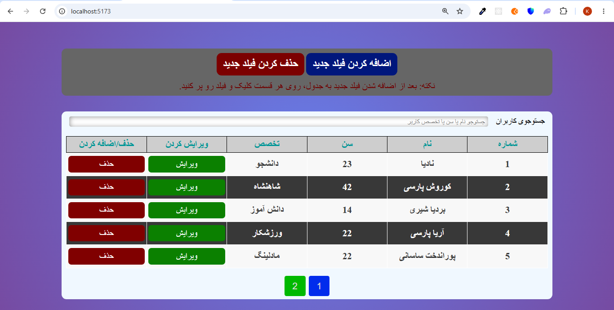
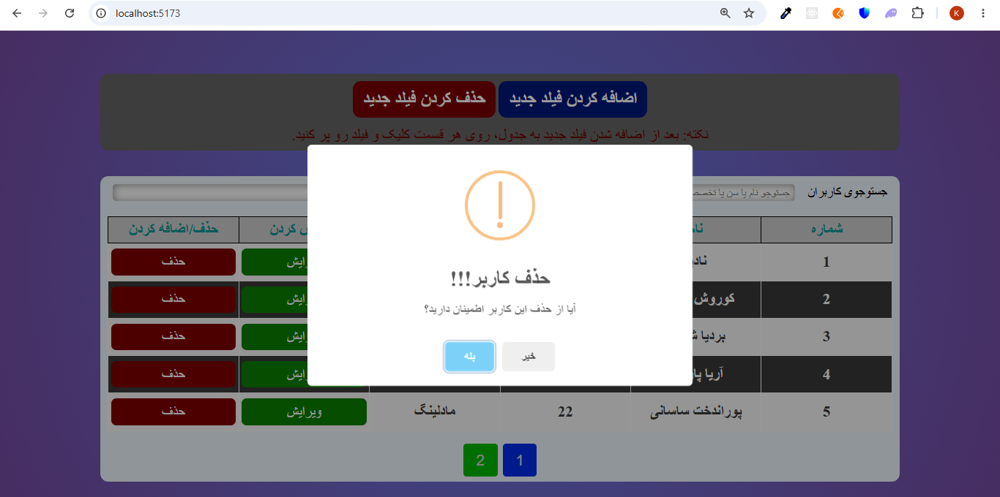

# Vue Articles Blog

A responsive users pagination application built with jquery, TypeScript, Sass.

## Features

* Display users pagination
* View users pagination details
* Responsive UI
* Mock REST API with supabase

## Screenshots

### Home Page



### Delete Modal



## Technologies

* JQuery
* TypeScript
* Sass
* supabase-server

## Installation

```bash
npm install
```

## Run the development server

```bash
npm run dev
```

## Project Structure

```
src/
 ├── api/
 ├── assets/
 ├── lib/
 ├── screenshots/
 ├── ts/
 ├── types/
 main.ts
```

## Future Improvements

* Add stronger form validation, including numeric validation for the age field.
* Improve error handling and loading states for API operations.
* Improve the inline editing experience.
* Add sorting functionality for users.
* Improve search and filtering capabilities.
* Add responsive design improvements for smaller screens.
* Add unit and integration tests.

## Author

Kourosh Ariayi
